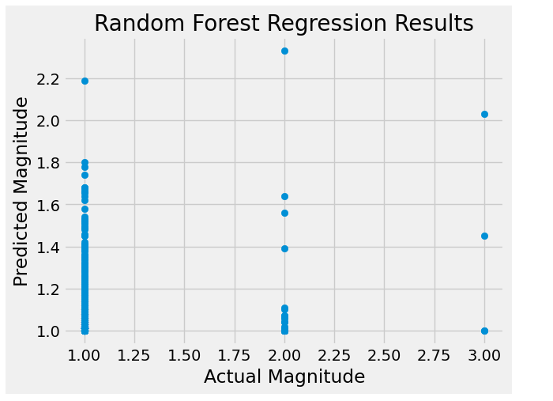
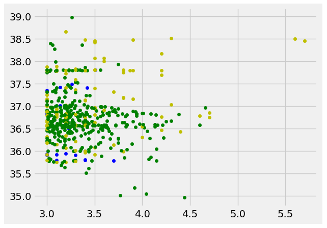
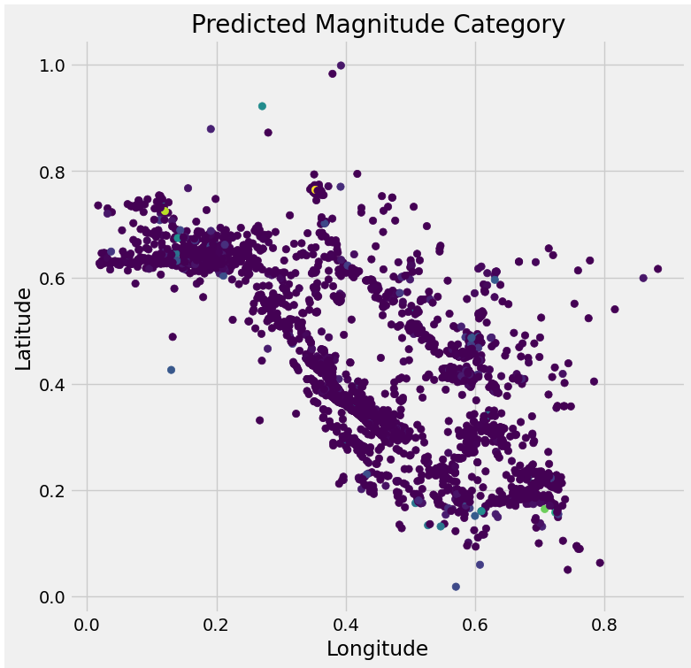
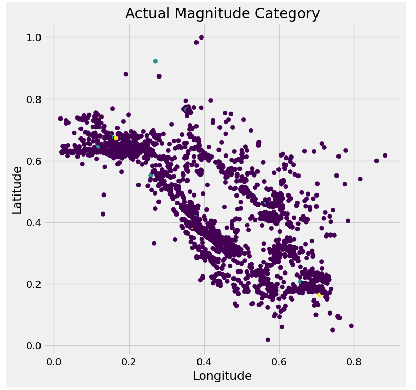

# Earthqukae Prediction 

### Data 606 final project report. 

### - Presentation video:

### Introduction:
Natural disasters like earthquakes can do a lot of damage and kill a lot of people. Precise expectation of quakes is fundamental for growing early advance notice frameworks, fiasco arranging, risk appraisal, and logical examination. There are around 18 earthquakes of magnitude 7.0 or higher every year worldwide. Since 1968, actual yearly numbers have ranged from lows of 6-7 incidents each year. But  earthquakes do have a distinct geographical patterns which can help to identify locations and magnitudes of certain future major earthquakes that are going to be produced, even though we are unable to anticipate individual earthquakes.
90% of earthquakes are naturally occurring and the consequence of tectonic action. 10% of the remaining traits are connected to volcanism, human-caused effects, or other factors.

### Dataset: 
The dataset is taken from Northern California Earthquake website. It contains information about earthquakes in California, United States, with a magnitude of 3.0 or greater. 
The dataset contains Earthquake details like Latitude, Longitude, Magnitude, Depth, Time, Azimuthal gap etc. The Data set contains 18030 rows and  13 attributes.

* Date and time of the earthquake in UTC: Date/time
* Latitude and longitude of the epicenter: Lat/Lon
* Depth of the earthquake: Depth
* Magnitude of the earthquake on the Richter scale: Mag
* SRC: Source
* NST: Number of stations used
* CLOSE: Closest station distance
* RMS: Root-mean-squared residual
* GAP: Azimuthal gap

### Preprocessing: 
Removed null values. Dropped all unnecessary unwanted columns.
### Libraries used:
Matplotlib. 
Numpy.
Basemap.
Pandas.
Seaborn.

### Objective:
Through this project i am going to implement a machine learning model for EarthQuake Prediction.

### Random Forest Model

Random Forest Classifier is an ensemble learning algorithm that combines multiple decision trees to make accurate predictions and reduce overfitting. It is effective for handling large datasets with high dimensionality and is less prone to overfitting compared to other models like Decision Trees.

### Support Vector Machine(SVM)

SVM is a powerful machine learning algorithm used for both classification and regression tasks. It works by finding the hyperplane that best separates the data into different classes, maximizing the margin between the classes. SVM is effective in handling high-dimensional datasets and is less prone to overfitting compared to other algorithms.

### Naive Bayes

Naive Bayes classifier is a simple probabilistic algorithm that is commonly used for classification tasks. It is based on Bayes' theorem, which describes the probability of an event occurring given some prior knowledge or evidence. In the context of classification, Naive Bayes classifier calculates the probability of a data point belonging to a particular class given its features. 

